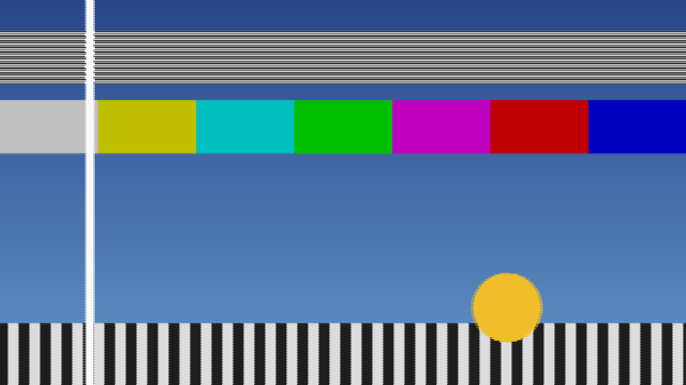

# standards

> **AI-assisted project.** This codebase was created with [Claude](https://claude.com/claude-code)
> (Anthropic), directed and reviewed by a human author. The conversion is not
> asserted but measured: an offline harness drives the real plugin class in a
> headless GL context and reads each claim back out of the picture — each output
> field's temporal weights, read from field numbers painted into the input, repeat
> bit for bit every six fields at 50 → 60 and creep 0.005 of a field per cycle at
> 50 → 59.94; a moving bar's repeats and double images sit where the time geometry
> puts them, whole-pixel and fractional; the vertical impulse response and a zone
> plate's measured G(f) are the stated taps' transfer function; Same returns the
> fielded input byte for byte; motion compensation smooths a pan to within a pixel
> and tears only where an occlusion's blocks reach — with sixteen negative controls
> that prove each check can fail. It has **never been loaded into Resolume on macOS**; on Windows it passed the
> fleet Arena gate. On macOS it is loaded by [oxbow](https://github.com/stoatworks-labs/oxbow), which is a real FFGL
> host and is not Resolume. See [Status](#status).

A field-store standards converter — PAL to NTSC and back — as an FFGL effect for
[Resolume](https://resolume.com) Arena and Avenue.



<sub>One frame, rendered by `sttest`, the offline harness — not captured from
Resolume. The defaults: 625/50 → 525/59.94, two fields in time, four taps in space,
woven onto the host's raster.</sub>

## The one idea

Until the 1990s, a programme crossing the Atlantic went through a box that turned
625-line, 50-field pictures into 525-line, 59.94-field ones. It had a store of a few
fields and it **interpolated**, twice:

- **in time** — each output field is made from the input fields either side of it,
  weighted by where it falls between them;
- **in space** — each output line is made from nearby lines of the field being read.

Neither interpolation knows anything about motion. The clip here becomes fields of
the source standard at that standard's own instants, and everything else follows.

## What falls out

None of these is drawn:

- **The judder cycle.** 50 into 60 is 5 into 6, so the weights repeat every six
  output fields and something moving smoothly advances in a stutter six fields long.
  At 59.94 the cycle also creeps, by 0.005 of a field every six.
- **Double images**, where an output field lands midway between two input fields and
  blends them. Drop/Repeat trades them for a repeated field; Four Field for a
  sharper, ringing blend.
- **The soft look**, from few vertical taps across interlaced lines — each output
  line is made only from the lines that exist in the field being read, which are two
  frame lines apart. Softness adds the older boxes' vertical pre-filter.
- **Motion compensation, crudely.** Block vectors between the two fields either side
  remove the judder on a pan and tear wherever a block holds two motions, which is
  how the first motion-compensated converters looked.

### The honest limit

The input is progressive, so a source field is the nearest host frame sampled onto
the standard's lines, the way a camera with a shutter would, not a field that was
shot. Nothing reads a real interlaced stream. Horizontal resolution is the host's
own; only the lines and the time base are converted. The converter has a latency of
two source fields, as a real one had. The display shows destination fields at host
frames, so 50 fields on a 60 Hz host picks up the display's own 5-in-6 cadence on
top of the conversion's, which is true of any 50 Hz picture on a 60 Hz screen.

## Controls

| Group | |
| --- | --- |
| **Conversion** | Direction (625/50 > 525/59.94, 525/59.94 > 625/50, 625/50 > 525/60, Same (no conversion)), Temporal (Drop/Repeat, Linear, Four Field), Vertical Taps (1, 2, 4, 8), Motion Comp. |
| **Display** | Show As (Weave, Bob), Output Size (Native Lines, Host). |
| **Look** | Softness, Mix. |

The temporal apertures: Drop/Repeat takes the nearest source field (a tie repeats
the earlier); Linear the two either side, weighted by distance; Four Field four
fields through Catmull-Rom. The vertical filters: nearest line, linear, Catmull-Rom,
and an eight-tap Lanczos, each on the lines of the field being read. Native Lines
shows one output row per destination line, centred; Host scales the destination
frame to the host's height.

## Status

**v0.1.0, and honestly early — 23 September 2026.**

### Measured offline, on macOS

`tools/verify.sh` passes on this machine (M4 Max, macOS 26.4.1) against a fresh
universal Release build, running every rendered check at **two rasters**, 320×180
and 1280×720; the same checks also pass at 333×187 and 1920×1080. What it
establishes:

| check | result |
| --- | --- |
| `--weights` | every destination field's weights, read out of the picture, are where the time geometry puts them: 772 fields over six direction/aperture cases, worst 4.9e-4 against one half-float ULP. 50 → 60 repeats **bit for bit** every six fields (123 pairs Linear, 121 Four Field); 50 → 59.94 creeps **0.004997** per six-field cycle against 0.005 over 120 pairs |
| `--judder` | a bar at 4 and 8 px a field lands at the stated positions **exactly**; at 2.3 and 7.3 px within 1.7e-4 px; Drop/Repeat shows 4 repeats where the geometry states 4 (one in six); Linear's two components carry the stated weights |
| `--lines` | marked host rows land on exactly the output rows the geometry says, both directions and Same, at host and native size, all four parity pairs; the impulse response matches every stated tap at 960 and 1,152 destination lines per tap count (worst 4.6e-4); 3,036 zone-plate fits of G(f) per phase class sit within a quarter of their derived tolerance |
| `--same` | 78 frames at 60 fps, woven from the nearest host frames: **0** bytes differ; the store is the identity at 1, 2, 4 and 8 taps, bit for bit |
| `--mc` | a 3 px/field pan with Motion Comp steps 2.5 px a field within 0.5 px (spec: 1 px) as one image; without it the step strays 2.5 px; an occlusion tears by 0.72 inside the predicted blocks and matches the ideal to 4.9e-4 outside them |
| `--resize` | the raster doubled mid-run; fields shown after it from fields captured before it carry the stated weights |
| `--offline` | the plugin's apertures and filters against the stated geometry to 1e-12; a six-day millisecond host clock makes the same fields as a fresh one on 3,000 frames; names within 16 characters |
| `--negative` | sixteen perturbed models — swapped weights, 59.94 as 60, floor for nearest, parity ignored, Catmull-Rom detuned, capture at-or-before, vectors unapplied or reversed, a resize that re-primes, a float clock — each **fails** its check |
| mutation | one character of the shipped GLSL (`first + t` → `first - t` in the convert pass) was caught by `--lines` (14 checks) and `--same` (2), then reverted |
| `tools/sweep.py` | all **8** controls measurably change the picture |
| shaders | all 8, as the plugin compiles them, through `glslc` |
| `--pipe` | 2.5 frames in, exactly 2 out; an unknown cue refused (2); a failed render and a closed stdout each exit 1 |
| the bundle | universal (`x86_64 arm64`), exports `plugMain`, ad-hoc signs; `oxbow` reports `SW Standards` / `ST01` / `effect` and renders 120 frames through `plugMain` |

Render cost at the defaults, best of three runs of 60 frames after a warm-up,
`glFinish` both sides, on a GPU shared with other work: **0.12 ms** at 720p,
**0.19 ms** at 1080p, **0.42 ms** at 4K. With Motion Comp, which adds a block search
per source pair: **0.77 ms** at 720p, **1.04 ms** at 1080p, **1.81 ms** at 4K. macOS
figures only.

### Not established

It has **never been loaded into Resolume on macOS**. Everything above was
compiled, rendered and measured offline against the real plugin class in a headless
CGL context, plus an `oxbow` load. How it looks on footage, how eight controls read
in Arena's inspector, and what Arena's clock does to the field schedule over a long
session are untested. On Windows, v0.1.0's CI build passed the fleet Arena gate 9 of 9 on win-lab (Resolume Arena 7.27.1, Mesa llvmpipe, no GPU, 2026-09-24): it loads from Extra Effects, registers as `SW Standards` / `ST01` / effect, all 14 host controls match the declaration, every control moves the picture, it renders and Arena's log stays clean. The gate's picture is a still, so the judder itself was not seen there. Software rendering says nothing about a GPU or about speed. No OpenFX port
and no browser demo, neither in scope for 0.1.0. There is a [user guide](https://stoatworks-labs.com/software/standards/guide/).

## Build

Needs CMake 3.15+, a C++17 compiler, and the FFGL SDK submodule.

```bash
git clone --recursive https://github.com/stoatworks-labs/standards
cd standards
cmake -B build -DCMAKE_BUILD_TYPE=Release
cmake --build build --parallel
cmake --install build     # into ~/Documents/Resolume Arena/Extra Effects
```

macOS builds are universal (Apple Silicon + Intel) by default; add
`-DCMAKE_OSX_ARCHITECTURES=arm64` for a faster dev build. Windows needs GLEW via vcpkg.

## Building and testing

The offline harness renders the real plugin class headlessly, on a synthetic clock
fast enough to put every field instant on a host frame:

```bash
./build/sttest --out /tmp/frame.png --size 1920x1080   # the moving card
./build/sttest --list                                  # every control, kind and default
./build/sttest --weights --judder --lines              # each claim, measured
./build/sttest --same --mc --resize
./build/sttest --negative                              # and the checks can fail
./build/sttest --offline                               # what needs no GL (CI)
./build/sttest --bench                                 # 720p, 1080p and 4K
python3 tools/sweep.py                                 # no control is silently dead
tools/verify.sh                                        # all of it, on a fresh universal build
```

Every check takes `--size`; run it at 320×180 as well as the raster you care about.
Footage goes through the real shaders with `--pipe`, in the fleet's frame format:

```bash
ffmpeg -i in.mov -f rawvideo -pix_fmt rgba - \
  | ./build/sttest --pipe --size 1920x1080 --fps 60 --script cues.txt \
  | ffmpeg -f rawvideo -pix_fmt rgba -s 1920x1080 -r 60 -i - out.mov
```

See [`CLAUDE.md`](CLAUDE.md) for the full command reference and
[`AGENTS.md`](AGENTS.md) for the model and the traps.

<!-- attributions:start -->
This project is built on other people's work — see [ATTRIBUTIONS.md](ATTRIBUTIONS.md).
<!-- attributions:end -->

## Licence

MIT — see [LICENSE](LICENSE).
