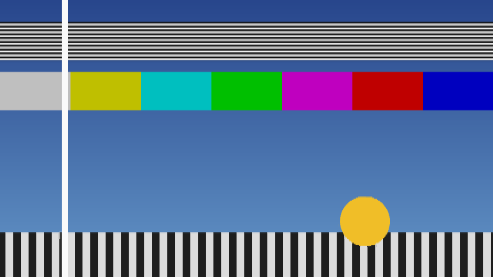

# Standards user guide

Standards is **a field-store standards converter for [Resolume](https://resolume.com) Arena and
Avenue**, as an FFGL effect: the box that turned 625-line, 50-field PAL pictures into 525-line,
59.94-field NTSC ones, and back. It does not paint a judder or a ghost over a clip. It turns the
clip into fields of the source standard at that standard's own instants, and then does what the
old converters did — two interpolations, one in time and one in space, neither of which knows
anything about motion. The stutter, the double images and the soft picture are what falls out.


*The harness's moving test card through the defaults — 625/50 to 525/59.94, two fields in time,
four taps in space, woven onto the host's raster. The white bar sits between two source fields
and is shown twice at half strength; the disc's edges comb where the two woven fields disagree;
the fine horizontal lines have become a beat pattern. Rendered by the offline harness, not
captured from Resolume.*

> **Before you rely on this:** released at **v0.1.0**, and honestly early. The conversion is
> measured rather than asserted, by a harness that drives the real plugin class and reads each
> claim back out of the picture: every output field's temporal weights sit where the time geometry
> puts them, 772 fields over six cases, worst error 4.9e-4, one half-float step; at 50 → 60 the
> weights repeat **bit for bit** every six fields; at 50 → 59.94 the cycle creeps **0.004997** of a
> field every six against 0.005 predicted; a moving bar at 4 and 8 px a field lands exactly where
> the geometry puts it, and at 2.3 and 7.3 px within 1.7e-4 px; Same returns the fielded input
> with **0 bytes different** over 78 frames; Motion Comp steps a pan within 0.5 px of the stated
> 2.5 px a field as one image; and sixteen deliberate faults are shown to make those checks fail.
> All 8 controls are shown to change the picture. It has **never been loaded into Resolume on
> macOS** — the one host it has run in is the fleet's own test host, `oxbow`, for 120 frames.
> On Windows, a build of v0.1.0 loads, registers and renders in Resolume Arena 7.27.1, with every control matching what the plugin declares and every control shown moving the picture — on software rendering, so that says nothing about a GPU, and on a still picture, so the judder it exists to show was not seen there.
> Try it on a spare layer before you put it in a show.
>
> This codebase was created with AI assistance, directed and reviewed by a human author.

---

## Installing

Every download carries one effect, **SW Standards**. Drop it into Resolume's effects folder and
restart Resolume:

```
macOS    ~/Documents/Resolume Arena/Extra Effects/
Windows  %USERPROFILE%\Documents\Resolume Arena\Extra Effects\
```

Avenue uses the same layout under its own folder name. The effect then appears in the effects
browser as **SW Standards**.

The macOS download is a universal build (Apple silicon and Intel), as a `.dmg` or a `.zip`. It is
**Developer ID-signed and notarised**, so the bundle simply loads. The
Windows download is an x64 installer or a `.zip`. It is not code-signed, so the installer trips
SmartScreen once: **More info** → **Run anyway**.

---

## Two interpolations and no idea of motion

Europe ran television at 625 lines and 50 fields a second; North America and Japan at 525 lines
and 59.94. A programme crossing between them, through the 1970s and 1980s, went through a
converter: a box with a store of a few fields that built every output field out of the input
fields around it. It interpolated twice:

- **In time.** Each output field falls somewhere between two input fields, and is made from the
  input fields either side of it, weighted by how close it is to each.
- **In space.** Each output line falls somewhere between the input lines, and is made from the
  nearby lines of the field being read — and in an interlaced field those lines are two picture
  lines apart, because the other half belong to the other field.

Neither interpolation knows what is moving. Everything anybody remembers about a converted
picture follows from that:

- **The judder cycle.** 50 into 60 is 5 into 6, so the output fields land at the same six
  positions between input fields over and over: one right on a field, then five-sixths of the
  way along, two-thirds, a half, a third, a sixth — and round again. Something moving smoothly
  advances in a stutter six fields long. At 59.94 rather than 60 the cycle does not quite repeat:
  it **creeps**, by 0.005 of a field every six, so the stutter slowly drifts.
- **Double images.** An output field that lands halfway between two input fields is an even mix
  of both, so anything moving shows twice at half strength — as the white bar in the picture above
  does.
- **The soft look.** Few taps across lines that are two picture lines apart lose vertical detail,
  and fine horizontal lines beat against the new line structure.
- **Motion compensation, crudely.** The later converters measured motion in blocks and moved the
  picture along it. On a pan that removes the judder; where one block holds two motions, it tears.

The clip is progressive, so the plugin first turns it into fields: each field of the source
standard is taken from the host frame nearest that field's instant, sampled onto that field's
lines, as a camera with a shutter would take it. Everything else is the converter.

**This is a temporal effect. On a still picture it does nothing visible but soften it and change
its lines.** It needs something moving — a pan, a scroll, a spinning logo — and it shows best on
steady, smooth motion, where the stutter has something even to break up.

---

## Start here

Put SW Standards **on a layer** with something panning or moving smoothly in it, and leave every
control alone. The defaults are the classic transatlantic direction: **625/50 into 525/59.94**,
two fields blended in time (Linear), four taps in space, woven onto the host's full height, with a
little of the older boxes' vertical softening. Watch anything that moves: it stutters in a
six-field cycle, and its edges double where an output field lands between two input fields.

Why the layer: an effect on a clip belongs to that clip, so it only ever sees that clip. On the
layer, the converter sees a cut between clips as a real one would, and an output field that lands
between the last field of the old shot and the first of the new blends the two.

Then, in this order:

1. **Temporal → Drop/Repeat.** The double images go, and a hard stutter takes their place: one
   field in every six is shown twice.
2. **Temporal → Four Field.** A sharper blend from four fields, with a faint ringing edge either
   side of anything moving.
3. **Direction → 525/59.94 > 625/50.** The other way across the Atlantic. Now there are more input
   fields than output ones, so under Drop/Repeat about one field in six is skipped rather than
   repeated.
4. **Motion Comp on.** The pan smooths out. Watch where something moves across a background
   moving differently: the blocks that hold both tear.
5. **Direction → Same (no conversion).** No converter at all: every output field is exactly one
   input field on exactly its own lines, so only the fields, the weave and Softness are left. The
   baseline to compare the others against; with Softness at 0 it is the fielded clip, untouched.
6. **Vertical Taps → 1, Softness → 0.** The crunchiest vertical picture the plugin makes: each
   output line is simply the nearest input line.

The picture you see is about **two source fields late** — 40 ms from a 625/50 source, about
33 ms from a 525/59.94 one — plus up to one more output field under Weave. A real converter had
the same latency, and the plugin keeps it the same whatever Temporal says, so changing Temporal
never makes the picture jump.

---

## Time is the host's clock, not frames

The fields are at their standards' own instants — every 1/50 s for 625/50, every 1001/60000 s for
525/59.94 — measured on Resolume's clock, not counted in rendered frames. So the conversion runs
at the same speed whatever your composition's frame rate, and an export converts the same as the
preview.

Each rendered frame shows the newest output fields that are ready. That adds the display's own
cadence on top of the conversion's, as any screen does: **50 fields on a 60 fps composition
shows a 5-in-6 cadence of its own**, even under Same. At 60 fps against a 59.94 output, a field
is shown twice about every 17 seconds; that is the display, not the converter, and it has not
been seen in a host.

If the host's clock goes backwards or leaps more than half a second — a stall, a jump — the
converter treats it as one ordinary frame of a sixtieth of a second and carries on from there.
It does not try to catch up field by field.

---

## The Conversion group

**Direction** — which standards, in and out:

| Direction | What it does |
| --- | --- |
| **625/50 > 525/59.94** | The default. PAL into NTSC: 576 active lines into 480, 50 fields into 59.94. The six-field judder, creeping. |
| **525/59.94 > 625/50** | NTSC into PAL: 480 lines into 576, 59.94 fields into 50. Fewer output fields than input ones, so Drop/Repeat drops rather than repeats. |
| **625/50 > 525/60** | Into 525 lines at exactly 60 fields, the old monochrome rate. The same judder with no creep: the weights repeat exactly every six fields. |
| **Same (no conversion)** | 625/50 in and out. The field store and nothing else. |

Both standards are **top field first**. Changing Direction is changing the machine: the field
store is emptied and filled again with the current picture, so the output holds still for a
moment — about the converter's latency — before the motion comes back.

**Temporal** — how each output field is made from the input fields around it in time:

| Temporal | What it does |
| --- | --- |
| **Drop/Repeat** | The single nearest input field. Exactly halfway, the earlier one. No double images; instead a field is repeated (or, 525 into 625, skipped) once in about every six. |
| **Linear** | The default. The two input fields either side, weighted by how near each is. Double images wherever an output field lands between two inputs. |
| **Four Field** | Four input fields, through a Catmull-Rom curve. A sharper blend than Linear, with a faint ringing either side of moving edges, because the curve's outer weights are negative. |

**Vertical Taps** — **1, 2, 4 or 8**; **4** by default. How many lines of the input field make
each output line. 1 is the nearest line; 2 a straight blend of the two either side; 4 a
Catmull-Rom curve; 8 a Lanczos filter, the sharpest. Every tap reads a line that exists in the
field being read, never a line from the other field. Fewer taps alias more: fine horizontal
detail breaks into bands. More taps hold detail better and ring slightly on hard horizontal edges.

**Motion Comp** — off by default. Crude block motion compensation, the way the first
motion-compensated converters worked. The picture is cut into blocks 16 pixels wide and 8 field
lines high; for each block the plugin finds how far it moved between the two input fields either
side of the output field, up to **16 pixels sideways and 2 field lines up or down**, and every
field in the blend is fetched along that vector to where it would be at the output field's
instant. Sideways the fetch is to a fraction of a pixel; up and down it is rounded to the nearest
field line. On a pan the judder goes and the double image closes to one. Where a block holds two
motions — something crossing a background moving differently — the block moves with one of them
and tears against the other. Motion faster than 16 pixels a field (800 pixels a second on a
625/50 source) is not found. It costs more than anything else here; see Performance.



*The same moment of the test card as the picture at the top, with Motion Comp on and Show As on
Bob. The white bar is a single image again, and with one field shown nothing combs. Rendered by
the offline harness, not captured from Resolume.*

---

## The Display group

**Show As** — how the output fields become a picture:

- **Weave** — the default. The latest complete pair of output fields, each on its own lines, as an
  interlaced monitor shows them. Anything moving combs, because the two fields are from different
  instants. It can be one field later than Bob.
- **Bob** — the latest output field only, with each missing line the average of the field's lines
  above and below. No combing, and half the vertical detail.

**Output Size** — how the output lines fill the host's picture:

- **Host** — the default. The output frame stretched to the full height of your composition. Each
  row shows the nearest output line with no smoothing, so at 1080 rows a 480-line picture is about
  two and a quarter rows a line, and at 720 rows alternately one and two — which can show as
  uneven line thickness on fine detail.
- **Native Lines** — one row of the composition per output line, centred, with black above and
  below (or cropped, if the composition is shorter). The width still fills the composition, so the
  picture is squashed vertically: this is for seeing the line structure, not for a picture of the
  right shape. The black bars are opaque.

Horizontally nothing is converted in either mode: the store keeps your composition's own width.

---

## The Look group

**Softness** — **0 to 1**, **0.25** by default. The older converters' vertical pre-filter: before
the taps, each field line is blended with the field lines above and below it, a quarter of
Softness from each. At 1 that is a quarter, a half and a quarter; at 0 there is no pre-filter at
all. Raise it to calm fine horizontal lines that beat or flicker; lower it for the crispest,
most aliased picture. It works across the lines of one field, which are two picture lines apart.

**Mix** — the converted picture against the untouched clip; **1** by default. Zero is the clip as
it arrived. The converter keeps running whatever Mix says. Note that the clip side of the mix is
the **live** frame, while the converted side is two fields late — so anywhere between 0 and 1,
anything moving shows twice, once from each.

The clip's alpha goes through the store with the colour: it is fielded and interpolated like the
picture.

---

## How it works

The CPU decides every number; the GPU only multiplies and adds. Once a frame:

1. **Capture.** The composition's frame is sampled onto the source standard's lines — each line
   takes the host row under its centre — at the composition's own width.
2. **Fields.** Every source field whose instant has passed since the last frame is made from
   whichever of this frame and the previous one was nearer that instant, as its parity's lines,
   into a store of eight.
3. **Motion** (Motion Comp only). One vector per block between the two source fields either side
   of the output field.
4. **Convert.** Every output field now due is built from one, two or four source fields, each
   filtered onto the output lines by a table of taps, and summed with the temporal weights. Both
   the table and the weights are worked out on the CPU from exact fractions — at 50 → 60, output
   field j sits at exactly 5j/6 source fields — so nothing that decides a field or a line is
   rounded. Output fields are released two source fields after their instant, and
   only once every field they need is in the store.
5. **Display.** The latest pair woven, or the latest field bobbed, onto the composition, at
   Output Size, against the clip at Mix.

Every line is read whole, never blended with the row next to it by the GPU, because two rows of
an interlaced frame are two moments. On the first frame the store is filled with seven fields of
that picture, so there is an output straight away and nothing fades up from black. A change of
composition size carries every stored field over to the new width rather than starting again.

---

## Performance

Measured by the offline harness on an M4 Max, at the defaults, best of three runs of 60 frames
after a warm-up, on a GPU shared with other work:

| | ms/frame | % of a 60 fps frame | with Motion Comp |
| --- | --- | --- | --- |
| 1280×720 | 0.12 | 0.7% | 0.77 |
| 1920×1080 | 0.19 | 1.1% | 1.04 |
| 3840×2160 | 0.42 | 2.5% | 1.81 |

**Motion Comp is most of the cost**, and even that is small. The plugin keeps its field store in
half-float at your composition's width — about 80 MB at 1080p and 160 MB at 4K for 625 into 525,
worked out from the buffers it allocates rather than measured. The motion search's buffer is part
of that and is allocated whether Motion Comp is on or not. Nothing was timed inside Resolume, and
nothing was timed on Windows.

---

## If it looks wrong

**Nothing seems to happen, except a softer picture.** The clip is still, or nearly. A converter
does nothing visible to a still picture but soften it. Use something that pans. Check Mix.

**It judders even on Same.** Same is 50 fields shown on your composition's frame rate; at 60 fps
that is the display's own 5-in-6 cadence, which any 50 Hz picture on a 60 Hz screen has.

**Moving edges comb.** Show As is on Weave, which is what an interlaced monitor does. Use Bob.

**The picture is squashed, with black above and below.** Output Size is on Native Lines. Use Host.

**Fine horizontal lines beat, flicker or break into bands.** The capture takes one row per line,
so detail finer than the standard's lines aliases, as an unfiltered camera would. Raise Softness,
or use more Vertical Taps.

**Motion Comp tears.** Where a block holds two motions it moves with one and tears against the
other. That is the look of the early motion-compensated converters. A very fast pan — more than 16
pixels a field — is not followed at all.

**The picture held still for a moment.** Direction changed, and the store was filled again from
the current picture.

**The picture lags the audio.** By about two source fields, as a real converter did; a little more
under Weave. See Start here.

**A cut to another clip is not blended.** The effect is on the clip rather than the layer. Move it
to the layer.

**SW Standards is not in the effects browser.** Check the folder under Installing, and that
Resolume was restarted.

**The effect does nothing at all.** A shader that will not compile looks exactly like that, and
the real message is in the log:

```
macOS    ~/Library/Logs/standards/standards.YYYY-MM-DD.log
Windows  %LOCALAPPDATA%\standards\logs\standards.YYYY-MM-DD.log
```

It records the GL vendor, renderer and version at load, which shader failed if one did, a field
store that could not be allocated, every resize, and at frame 60 the host's clock and the unit the
plugin decided it was in.

---

## Known limits

- **Never loaded into Resolume on macOS**, and nothing has driven the controls in a host. How the
  three groups and the dropdowns read in the inspector, and what Resolume's clock does to the
  field timing over a long session, are untested.
- **Never seen on footage.** Every picture so far is a synthetic test card. Whether it reads as a
  1980s transatlantic feed to someone who watched one is unjudged.
- **The input is progressive.** A source field is the nearest host frame sampled onto the
  standard's lines, not a field that was shot. Nothing reads a real interlaced stream.
- **Only the lines and the time base are converted.** The horizontal resolution is your
  composition's own.
- **The capture is a point sample**, one host row per line, so a composition taller than the
  standard aliases vertically. Softness is the only pre-filter.
- **The motion compensation is crude by design** — whole-pixel vectors, one per block, vertical
  fetches rounded to a field line — and has only been checked on horizontal motion: a pan and one
  occlusion. Vertical vectors are found and applied, but no check moves anything vertically. Its
  ±16 pixel search is outrun by a fast pan at 4K.
- **Not verified at 4K**, only timed there.
- **No audio input and no presets.** No OpenFX version and no browser demo.
- **Only ever run on Apple silicon** on macOS, although the macOS build contains an Intel slice.

---

## About

The last group, **About**, carries the plugin's name, version, licence and maker, and buttons
that open this user guide, the project page, the source on GitHub and the support page in your
browser.

## Reporting something

[github.com/stoatworks-labs/standards/issues](https://github.com/stoatworks-labs/standards/issues).
A screenshot, the Direction, Temporal, Vertical Taps, Motion Comp, Show As and Output Size
settings, and the composition's resolution and frame rate are usually enough. If the effect did
nothing, attach the log.
